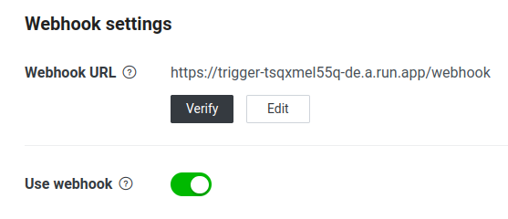
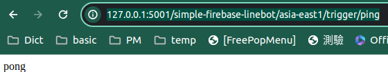

# 建立LINE BOT - 使用Firebase function

## 目錄

- [取出LINE BOT需要的設定](#取出LINE-BOT需要的設定)
- [安裝套件與部屬LINE BOT](#安裝套件與部屬LINE-BOT)
- [將你的LINE BOT分享給別人](#將你的LINE-BOT分享給別人)
- [本機開發LINE BOT](#本機開發LINE-BOT)
- [簡易Line Notify API](#簡易Line-Notify-API)
  - [Line Notify所需的環境變數](#加Line-Notify所需的環境變數)
  - [本機測試Line Notify](#本機測試Line-Notify)
  - [線上測試Line Notify](#線上測試Line-Notify)
- [Appendix](#Appendix)
  - [改變functions的名稱](#改變functions的名稱)
  - [pnpm套件管理指令](#pnpm套件管理指令)

## 更新紀錄

**2025-07-24**

   1. 升級@line/bot-sdk到9.9.0版
   2. 因github通知相關套件有弱點,升級所有相依套件以及pnpm

**2025-04-01**

   使用node v20與firebase CLI v14.0.1部屬成功且功能正常

**2025-04-08**

   1. 升級@line/bot-sdk到9.8.0版
   2. 加入一個最小可用的Line Notify API供推播訊息

## 取出LINE BOT需要的設定

註冊並登入[LINE developer](https://developers.line.biz/en/)

1. 左邊Providers選單 > 點'Create' 命名以建立Provider

2. 左邊點剛建立的Provider > Create a Messaging API channel > 填寫 Channel的基本資訊 > 建立Channel

3. 在Provider下會看到Channels分頁建立了剛才的Messaging API channel > 點擊它進入設定 > 分頁 Basic settings 下有 `Channel ID`, `Channel secret` > 分頁 Messaging API 下有 `Channel access token`

4. 在functions目錄下建立`.env`檔案，把上面取得的資料都寫進去

   ```bash
   LINE_CHANNEL_ID=
   LINE_CHANNEL_SECRET=
   LINE_CHANNEL_TOKEN=
   ```

## 安裝套件與部屬LINE BOT

1. 安裝nvm(Node Version Manager)

   如果你的環境已經有裝npm就怕版本不合,所以用nvm管理就可以快速的切換執行的node版本

   跑一下[nvm的github](https://github.com/nvm-sh/nvm)安裝script並安裝node v20

   ```bash
   curl -o- https://raw.githubusercontent.com/nvm-sh/nvm/v0.39.5/install.sh | bash
   nvm -v  # 0.39.5
   nvm install 20
   nvm use 20
   node -v # v20.19.4
   ```

2. 安裝firebase工具

   `npm install -g firebase-tools`

   `firebase -V` 顯示版本為 14.11.1

3. 登入firebase

   `firebase login`

4. 安裝專案套件並部屬

   ```bash
   cd functions
   pnpm install
   pnpm run deploy
   ```

   如果是要從無到有建立

   ```bash
   firebase init functions
   firebase deploy --only functions
   ```

   舉例我的部屬完是生成了URL: `https://trigger-tsqxmel55q-de.a.run.app`

5. 測試

   直接用`/ping`測試是否正確

   `curl https://trigger-tsqxmel55q-de.a.run.app/ping`

   會得到`pong`的訊息

6. 拷貝上面部屬生成的url到LINE Developers的web hooks中

   將部屬的URL拿去設定在LINE Developers > Messaging API > Webhook URL中

   `https://trigger-tsqxmel55q-de.a.run.app/webhook`

   

## 將你的LINE BOT分享給別人

登入[LINE developer](https://developers.line.biz/en/)

左邊選前面建立的Provider > 分頁 Channels 中點選 Messaging API 的卡片 > 分頁 Messaging API 下面就有 `Bot basic ID`

預設是一個以@起頭的一個ID，可以直接分享給其他人請他們加入，或是在網頁上以連結的形式寫成下面這樣

`https://line.me/R/ti/p/{BOT_BASIC_ID}`

舉我的BOT的例子，Bot basic ID是`@342mhjuj`，連結就會是

[https://line.me/R/ti/p/@342mhjuj](https://line.me/R/ti/p/@342mhjuj)


## 本機開發LINE BOT

`pnpm run serve` 跑起本機firebase function模擬器

啟動要等一下, 直到跑出url

    ✔  functions[asia-east1-trigger]: http function initialized (http://127.0.0.1:5001/simple-firebase-linebot/asia-east1/trigger).

用curl測試`/ping`可以得到pong結果

`curl 'http://127.0.0.1:5001/simple-firebase-linebot/asia-east1/trigger/ping'`



## 簡易Line Notify API

### Line Notify所需的環境變數

functions目錄下`.env`檔案，加入2項環境變數

  1. LINE_NOTIFY_GROUP_ID指定通知的群組ID
     這部份你可以把這個line bot加到群組,然後輸入訊息gid來取得你要通知到哪個群組ID
  2. LINE_NOTIFY_TOKEN指定通知的權杖(TOKEN)
     可以沿用之前Line Notify給的權杖,或是設定你喜歡的權杖

   ```bash
   LINE_NOTIFY_GROUP_ID=
   LINE_NOTIFY_TOKEN=
   ```

### 本機測試Line Notify

`pnpm run serve` 跑起本機firebase function模擬器

啟動要等一下, 直到跑出url

    ✔  functions[asia-east1-trigger]: http function initialized (http://127.0.0.1:5001/simple-firebase-linebot/asia-east1/trigger).

用curl測試`/api/notify`可以得到 {"message":"Success"} 訊息

```bash
curl -X POST "http://127.0.0.1:5001/simple-firebase-linebot/asia-east1/trigger/api/notify" \
   -H "Authorization: Bearer 在Bearer後空一格然後輸入你的權杖" \
   -d "message=Hello, Line Notify"
```

### 線上測試Line Notify

1. `pnpm run deploy` 部屬你的function

   部屬後會有個網址如下:

    Function URL (trigger(asia-east1)): https://trigger-tsqxmel55q-de.a.run.app

    ✔  Deploy complete!

    Project Console: https://console.firebase.google.com/project/simple-firebase-linebot/overview

2. 就用那個網址加入`/api/notify`進行測試, 可以得到 {"message":"Success"} 訊息

   ```bash
   curl -X POST "https://trigger-tsqxmel55q-de.a.run.app/api/notify" \
   -H "Authorization: Bearer 在Bearer後空一格然後輸入你的權杖" \
   -d "message=Hello, Line Notify"
   ```

## Appendix

### 改變functions的名稱

由於functions會在使用變數名稱作為url的一部分`trigger`, 若想要改成別的名稱

請修改`functions/index.js`的exports成你像要的`新的名稱`

`exports.新的名稱 = onRequest(app);`

部屬的時候firebase tool會自動偵測，並詢問是否要刪除舊有的，按確認就會自動處理。

如果失靈才需要用手動

- 手動刪除舊的部屬

  `firebase functions:delete trigger`

- 手動再部屬新的

  `firebase deploy --only functions:新的名稱`

### pnpm套件管理指令

- `pnpm add {套件名}`
- `pnpm add -D {套件名}`
- `pnpm remove {套件名}`
- `pnpm run {命令}`
