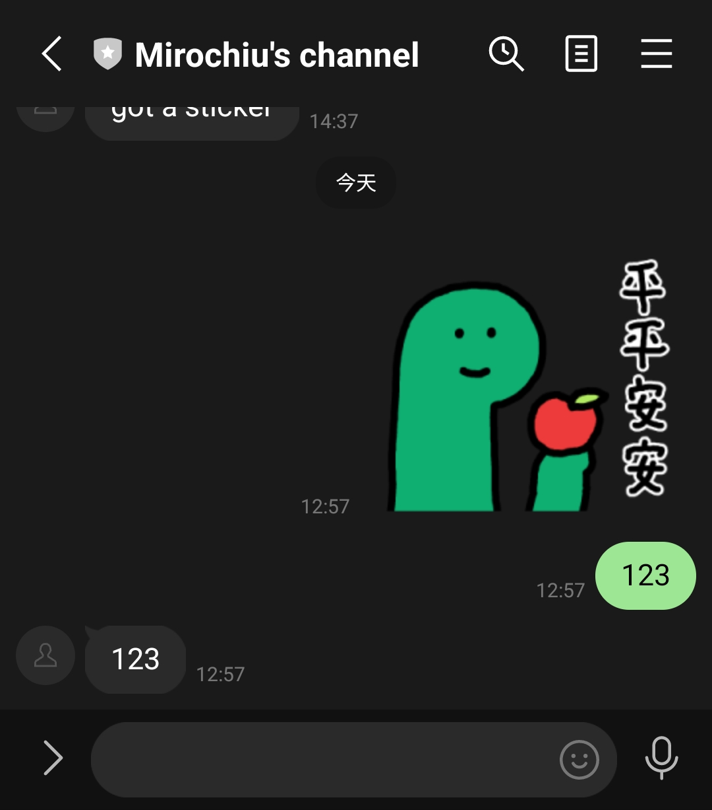

# 建立LINE BOT使用Firebase function

## 取出LINE BOT需要的設定

註冊並登入[LINE developer](https://developers.line.biz/en/)

1. 左邊Providers選單 > 點'Create' 命名以建立Provider

2. 左邊點剛建立的Provider > Create a Messaging API channel > 填寫 Channel的基本資訊 > 建立Channel

3. 在Provider下會看到Channels分頁建立了剛才的Messaging API channel > 點擊它進入設定 > 分頁 Basic settings 下有 `Channel ID`, `Channel secret` > 分頁 Messaging API 下有 `Channel access token`

4. 在functions目錄下建立`.env`檔案，把上面取得的資料都寫進去

   ```bash
   LINE_CHANNEL_ID=
   LINE_CHANNEL_SECRET=
   LINE_CHANNEL_TOKEN=
   ```

## 安裝套件

1. 安裝nvm(Node Version Manager)

   如果你的環境已經有裝npm就怕版本不合,所以用nvm管理就可以快速的切換執行的node版本

   跑一下[nvm的github](https://github.com/nvm-sh/nvm)安裝script並安裝node v18

   ```bash
   curl -o- https://raw.githubusercontent.com/nvm-sh/nvm/v0.39.5/install.sh | bash
   nvm -v  # 0.39.5
   nvm install 18
   nvm use 18
   node -v # v18.17.1
   ```

2. 安裝firebase工具

   `npm install -g firebase-tools`

3. 登入firebase

   `firebase login`

4. 安裝專案套件並部屬

   ```bash
   cd functions
   pnpm install
   pnpm run deploy
   ```

   如果是要從無到有建立

   ```bash
   firebase init functions
   firebase deploy --only functions
   ```

   舉例我的部屬完是生成了URL: `https://trigger-tsqxmel55q-de.a.run.app`

5. 測試

   直接用`/ping`測試是否正確

   `curl https://trigger-tsqxmel55q-de.a.run.app/ping`

   會得到`pong`的訊息

6. 拷貝上面部屬生成的url到LINE Developers的web hooks中

   將部屬的URL拿去設定在LINE Developers > Messaging API > Webhook URL中

   `https://trigger-tsqxmel55q-de.a.run.app/webhook`

   

## 將你的LINE BOT分享給別人

登入[LINE developer](https://developers.line.biz/en/)

左邊選前面建立的Provider > 分頁 Channels 中點選 Messaging API 的卡片 > 分頁 Messaging API 下面就有 `Bot basic ID`

預設是一個以@起頭的一個ID，可以直接分享給其他人請他們加入，或是在網頁上以連結的形式寫成下面這樣

`https://line.me/R/ti/p/{BOT_BASIC_ID}`

舉我的BOT的例子，Bot basic ID是`@342mhjuj`，連結就會是

[https://line.me/R/ti/p/@342mhjuj](https://line.me/R/ti/p/@342mhjuj)



## 改變functions的名稱

由於functions會在使用變數名稱作為url的一部分`trigger`, 若想要改成別的名稱

請修改`functions/index.js`的exports成你像要的`新的名稱`

`exports.新的名稱 = onRequest(app);`

部屬的時候firebase tool會自動偵測，並詢問是否要刪除舊有的，按確認就會自動處理。

如果失靈才需要用手動

手動刪除舊的部屬
`firebase functions:delete trigger`

手動再部屬新的
`firebase deploy --only functions:新的名稱`

